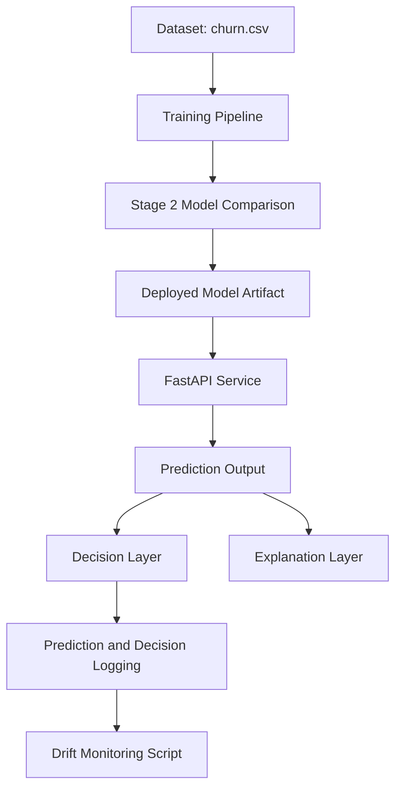

# BayesPilot Architecture

## System Overview

BayesPilot is a decision-support system for customer retention. It combines model training, business-aware model selection, API inference, and lightweight monitoring in one production-style flow.

End-to-end system path:

1. `churn.csv` is used to train candidate models.
2. A Stage 2 comparison step selects the model based on expected net benefit, not only predictive metrics.
3. The selected model artifact is deployed for inference.
4. FastAPI serves predictions for incoming customer data.
5. The decision layer converts probabilities into business actions using expected value logic.
6. Prediction and decision outcomes are logged.
7. Drift checks run on logged predictions to detect distribution shifts over time.

This structure keeps training, serving, decision policy, and monitoring logically separated while still connected by a clear data flow.

## Architecture Diagram

## Component Breakdown

### Data Layer
- **What it does:** Provides structured churn training data (`churn.csv`) and request-time customer feature inputs.
- **Why it exists:** A stable, consistent data contract is required for reproducible training and reliable inference.
- **How it connects:** Feeds the training pipeline during offline training and the API during online inference.

### Training Pipeline
- **What it does:** Trains candidate churn prediction models and prepares comparable outputs for evaluation.
- **Why it exists:** Separates model development from deployment so experimentation does not affect serving behavior.
- **How it connects:** Consumes dataset inputs and outputs candidate models/metrics for Stage 2 model selection.

### Model Selection (Stage 2)
- **What it does:** Compares candidate models using expected net benefit and selects the production model.
- **Why it exists:** Business value can differ from pure accuracy; this step aligns model choice with retention outcomes.
- **How it connects:** Receives artifacts from training, chooses a winner, and produces the deployed model artifact.

### Decision Layer
- **What it does:** Converts model probabilities into action recommendations via expected value logic.
- **Why it exists:** Operational decisions require explicit cost-benefit framing, not probabilities alone.
- **How it connects:** Consumes API prediction probabilities and sends decision outcomes to logging and downstream reporting.

### API Layer
- **What it does:** Exposes FastAPI endpoints for prediction and response orchestration.
- **Why it exists:** Creates a consistent interface between clients and the model/decision system.
- **How it connects:** Loads the deployed model artifact, runs inference, and returns prediction + decision + explanation payloads.

### Explanation Layer
- **What it does:** Provides interpretable context (global feature importance style outputs) alongside predictions.
- **Why it exists:** Supports trust, communication, and stakeholder understanding of model behavior.
- **How it connects:** Uses model outputs/features at inference time and returns explanation fields with API responses.

### Monitoring Layer
- **What it does:** Logs predictions/decisions and runs drift checks from stored logs.
- **Why it exists:** Enables post-deployment visibility without heavy operational overhead.
- **How it connects:** Receives log records from API/decision flow and analyzes them through a drift monitoring script.

## Data Flow Example

Example request path (single customer):

1. Client sends input JSON with customer features to the FastAPI endpoint.
2. API validates and preprocesses input into model-ready format.
3. Deployed model returns churn probability (for example, `0.72`).
4. Decision layer evaluates expected value and returns an action (for example, `offer_retention_incentive`).
5. Explanation layer attaches concise feature-importance context to support the recommendation.
6. API response returns prediction + decision + explanation.
7. Logging persists request features, probability, and decision outcome for monitoring and drift checks.

## Design Principles

- **Simplicity over complexity:** Keep architecture understandable and maintainable for a small production-style project.
- **Business-aware decision making:** Optimize for expected net benefit, not model score alone.
- **Modular pipeline design:** Separate training, selection, serving, decisioning, and monitoring to reduce coupling.
- **Lightweight monitoring:** Use practical logs + drift scripts to detect issues without distributed observability stack overhead.

## System Boundaries

BayesPilot intentionally does **not** include:

- Real-time retraining loops.
- Advanced drift detection or automated root-cause diagnostics.
- Local explainability methods such as SHAP per prediction.
- Distributed infrastructure (for example, streaming pipelines, multi-service orchestration, or autoscaling clusters).

These boundaries are deliberate to keep the project focused, explainable, and portfolio-friendly while still demonstrating production thinking.

## Summary

BayesPilot is designed as a clear decision-support pipeline: train models, select by business value, serve through API, convert probabilities into actions, and monitor behavior over time. The architecture prioritizes clarity, modularity, and practical tradeoffs that are easy to communicate in interviews.
